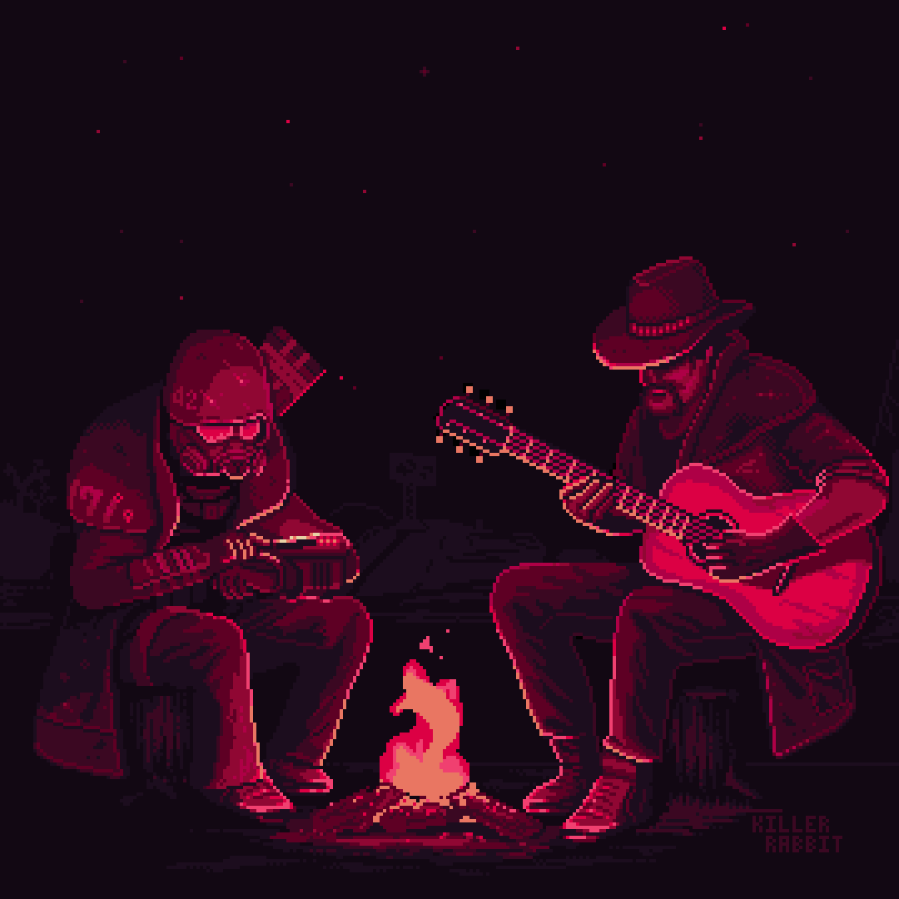

## About Me
- 🔭 I’m currently working on **3D websites**.
- 🌱 I’m currently learning **Three.js, Motion, and Next.js**.
- 👯 I’m looking to collaborate on **Three.js projects**.
- 👨‍💻 All of my projects are available on [GitHub](https://github.com/TinuCharly).
- 💬 Ask me about **React, Spline, Tailwind CSS**.
- ⚡ Fun fact: **Apple juice > Mango juice**.

---

## I'm Just a chill guy
<table>
  <tr>
    <td>
        

  

    </td>
  
<td>
    
    </td>
      <td>
      

    </td>
  </tr>
</table>

---

## Connect with Me:

  
  
  
  
  

---

